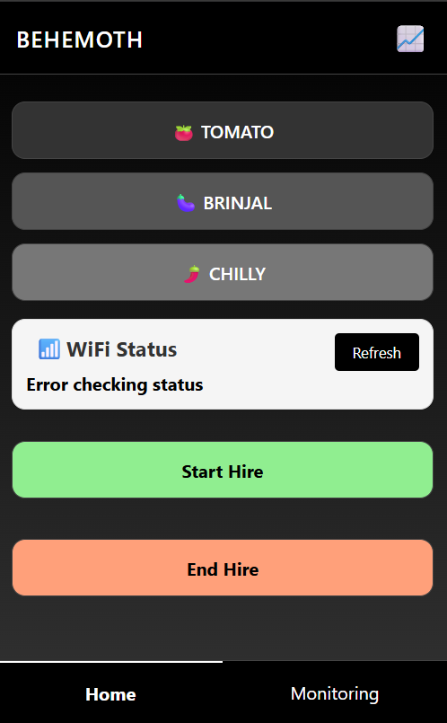

# Automatic Vegetable Transplanter - Control System

<div align="center">
  
  
  **ESP32-based control system for Team BEHEMOTH's automatic vegetable transplanter**
  
  🏆 **SAE India TIFAN 2025 Value Engineering Award Winner** 🏆
</div>

---

## 📖 Overview

This repository contains the **electronic control system and web interface** developed for Team BEHEMOTH's award-winning automatic vegetable transplanter project.

**Project Details:**
- 🥇 **Award**: Value Engineering Award Winner - SAE India TIFAN 2025
- 🎓 **University**: CUSAT (Cochin University of Science and Technology)
- 💻 **Repository**: Electronic control system & web interface code

<div align="center">
  
</div>

<div align="center">
  
</div>

## ⚡ Key Features

| Electronic Control | Web Interface |
|---|---|
| ✅ ESP32-based system | ✅ Mobile responsive design |
| ✅ Dual operation modes | ✅ Real-time monitoring |
| ✅ Sensor integration | ✅ Commercial billing features |
| ✅ Emergency stop safety | ✅ QR code WiFi access |

<div align="center">
  
</div>

## 🚀 Quick Start

### 1️⃣ Setup
```bash
git clone https://github.com/Deratheone/Behemoth.git
cd Behemoth
```

### 2️⃣ Upload Code
- Open `code/behemoth.ino` in Arduino IDE
- Select ESP32 board and upload

### 3️⃣ Connect & Access

<div align="center">
  
  
  **WiFi:** BEHEMOTH_AP | **Password:** behemoth123 | **URL:** 192.168.4.1
</div>

## 🔧 Technical Stack

| Component | Technology |
|---|---|
| **Microcontroller** | ESP32 WiFi Module |
| **Motors** | 2x Stepper (TB6600) + 2x Servo |
| **Sensors** | PIR Motion, Proximity, Water Level |
| **Interface** | Web App (HTML/CSS/JS) |
| **Features** | Real-time monitoring, SMS integration |

## 👥 Team & Contributors

<div align="center">
  
  
  **Team BEHEMOTH** - CUSAT SAE Team
</div>

**Project Roles:**
- 🔧 **Team BEHEMOTH**: Mechanical design & system integration
- 💻 **Repository Contributors**: Electronic control system & web interface development

## 🏆 Achievements

<div align="center">
  
| Achievement | Details |
|---|---|
| 🥇 **Award Winner** | SAE India TIFAN 2025 - Value Engineering |
| ⚡ **Control System** | Complete ESP32-based automation |
| 🌐 **Web Interface** | Real-time monitoring & control |
| 💼 **Commercial Ready** | Hire tracking & billing features |

</div>

---

<div align="center">
  
**🏆 SAE India TIFAN 2025 Value Engineering Award Winner 🏆**

*Electronic control system for Team BEHEMOTH's automatic vegetable transplanter*

</div>
