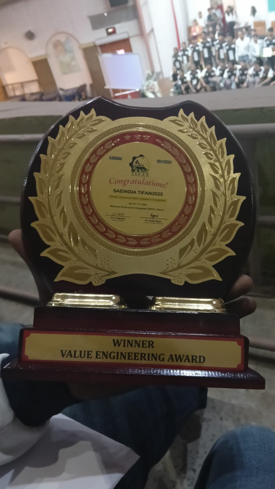
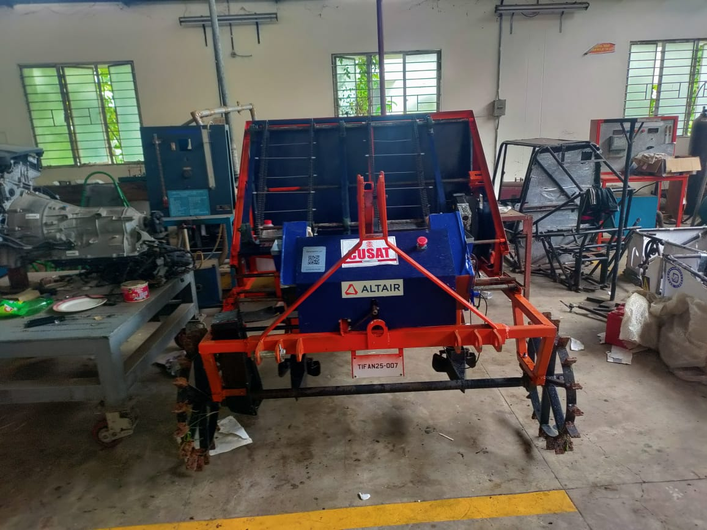
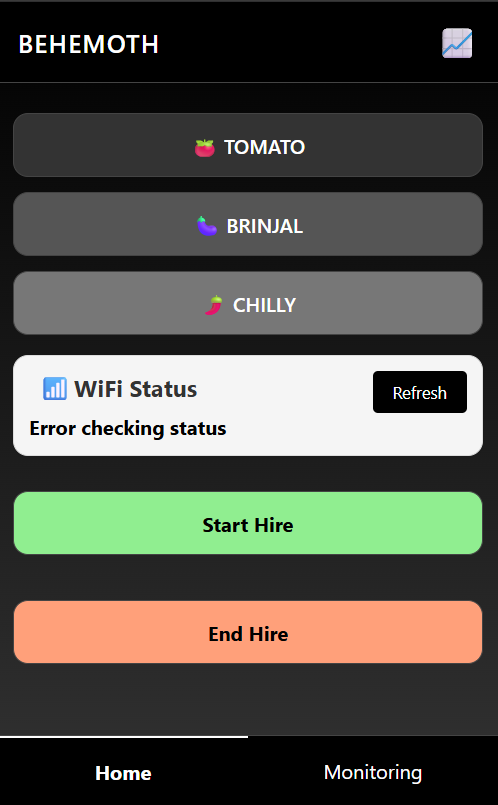
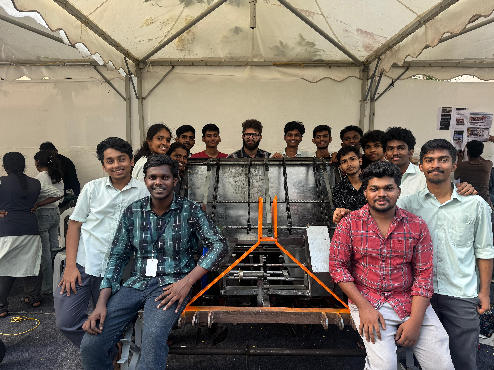

# Automatic Vegetable Transplanter - Control System

> ESP32-based control system developed for **Team BEHEMOTH's** automatic vegetable transplanter (SAE India TIFAN 2025 **Value Engineering Award Winner**)

## 📖 Overview

This repository contains the electronic control system and web interface for Team BEHEMOTH's award-winning automatic vegetable transplanter.

### 🏆 Achievement
- **🥇 Value Engineering Award Winner** - SAE India TIFAN 2025
- **Team**: BEHEMOTH (CUSAT)
- **My Role**: Electronic control system & web interface development

## 🔧 Key Features

### Electronic Control
- **ESP32-based**: WiFi-enabled microcontroller system
- **Dual modes**: Manual joystick & automated sensor control
- **Real-time monitoring**: Live system status via web interface
- **Emergency stop**: Safety shutdown system

### Web Interface
- **Mobile responsive**: Works on phones/tablets
- **Live data**: Plant count, water levels, system status
- **Commercial features**: Hire tracking & SMS billing
- **Easy access**: QR code for quick WiFi connection

## 🚀 Quick Start

### Setup
1. Clone: `git clone https://github.com/Deratheone/Behemoth.git`
2. Open `code/behemoth.ino` in Arduino IDE
3. Upload to ESP32

### Connect

- **WiFi**: BEHEMOTH_AP
- **Password**: behemoth123
- **URL**: 192.168.4.1

## ⚙️ Technical Details

### Hardware
- **ESP32** WiFi Module
- **2x Stepper Motors** (TB6600 drivers)
- **2x Servo Motors** 
- **PIR Sensors** for motion detection
- **Joystick** for manual control

### Software
- Real-time web interface
- Persistent data storage
- SMS integration
- Live sensor monitoring

## 👥 Team

**Team BEHEMOTH** - Mechanical design & integration (CUSAT)

**My Contribution:**
- ESP32 control system development
- Web interface & real-time monitoring
- SMS billing system
- Electronic integration with mechanical systems

## 🏆 Achievements

- 🥇 **Value Engineering Award** - SAE India TIFAN 2025
- ✅ **Complete control system** - ESP32-based automation
- ✅ **Web interface** - Real-time monitoring & control
- ✅ **Commercial features** - Hire tracking & billing

---

**🏆 SAE India TIFAN 2025 Value Engineering Award Winner**

*Electronic control system for Team BEHEMOTH's automatic vegetable transplanter*

 
